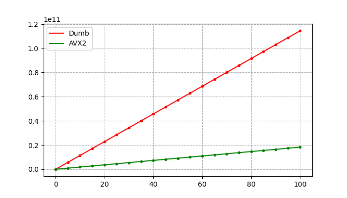
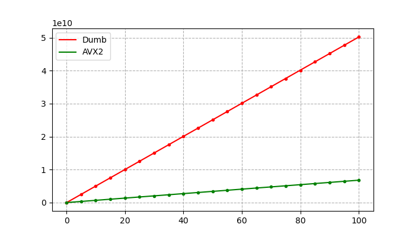

# Исследование возможностей SIMD-инструкций на примере задачи о расчете множества Мандельброта

## Введение
_Множеством Мандельброта_ называется множество точек $z_0$ комплексной плоскости, для которых 
рекуррентное соотношение $z_{n+1} = z_n^2 + z_0$ задает ограниченную последовательность,
то есть существует окружность радиуса $R$ такая, что 
$\forall n \in\{0, 1, ...\} \ | z_n | < R$.

Рассмотрим следующую задачу:
пусть начиная с некоторого номера $N$ точки последовательности $z_n$ более не принадлежат
окружности. Будем рассматривать функцию $N(z)$ в прямоугольнике $w \times h$. 
По значениям этой функции в конкретной точке
выбирается ее цвет, таким образом прямоугольник определенным образом раскрашивается.

Несложно заметить, что данный алгоритм предполагает большое количество вычислений и
процесс может занимать довольно много времени, ведь его асимптотика $O(Cwh)$.
Таким образом, возникает желание ускорить вычисления. Для этого естественно применить
параллелизацию, чтобы считать больше точек за раз. В современных процессорах
такая возможность реализована в виде _SIMD-инструкций_, выполняющих
операции не над одним скаляром, а сразу над вектором фиксированного размера. 

Данную работу мы будем выполнять на архитектуре x86-64.
В процессорах с этой архитектурой набор инструкций, реализующих принцип SIMD,
получил название AVX (_Advanced Vector Extensions_). AVX-инструкции реализованы 
аппаратно при помощи специальных регистров, способных хранить вектор целочисленных
значений размера 8, 16, 32 или 64 бита либо вектор значений с плавающей точкой 
одинарной или двойной точности.

## Реализация
Эксперимент будем выполнять на ноутбуке c процессором Intel Core i5-8400H Kaby Lake
и операционной системой Debian GNU/Linux.
Данный процессор поддерживает AVX2, что подразумевает максимальный размер векторных
регистров 256 бит.

### Рендер 
Для использования возможностей AVX-инструкций можно применять
соответвующие ассемблерные инструкции. Однако в нашем распоряжении есть компилятор
GCC, который поддерживает так называемые _интринсики_ 
([_intrinsics_](https://www.laruence.com/sse/#techs=MMX,SSE,SSE2,SSE3,SSSE3,SSE4_1,SSE4_2,AVX,AVX2,AVX_512)), 
что позволяет использовать их прямо из C++. 
Разумеется, это делает программу непереносимой на другие
архитектуры, но это оправдывается ускорением.

Для собственно отрисовки будем применять простую графическую библиотеку 
[SFML](https://www.sfml-dev.org/).
Общая последовательность вычислений при этом будет выглядеть следующим образом:
1. Проходим циклом по всем пикселям графического окна, пересчитываем его "натуральные" координаты
в координаты с плавающей точкой типа `float` с учетом масштаба и смещения начала координат.
Считаем $N(z)$ сразу для 8 соседних точек. При этом устанавливаем верхнюю границу $N_{max} = 256$,
чтобы предотвратить бесконечный цикл. Расчет прекращается в момент, когда все 8 точек вектора
оказываются за пределами окружности радиуса $R = 10$, либо счетчик достигает значения $N_{max}$.
Первоначально применялась наивная реализация, при которой $N(z)$ расчитывается для 
каждой отдельной точки.
Сохраняем значение вектора счетчиков в заранее заготовленный массив счетчиков. 
2. Пересчитываем значения счетчиков в RGBA цвета по формулам следующего вида:
```
R = CNT * R_COEFF % 256
G = CNT * G_COEFF % 256
B = CNT * B_COEFF % 256
A = 0xff
```
При `R_COEFF = 15`, `G_COEFF = 30`, `B_COEFF = 40` и размерах
окна $1024 \times 1024$ получим следующую картинку:


Полученное изображение позволяет удостовериться в правильности вычислений. 
Также в программу для полноты были добавлены следующие функции:
* перемещение изображения вправо-влево и вверх-вниз стрелками на клавиатуре;
* зум (по клавишам + и -, а также прокруткой мыши);
* отображение текущего показателя FPS.

### Измерение производительности
Итак, у нас есть 2 разных имплементации для вычисления $N(z)$: наивная 
и с использованием AVX. Сравним их производительность. Для этого будем в цикле
вызывать непосредственно функцию вычисления счетчиков $C$ раз и измерять время.

С измерением времени все не так просто, как может показаться на первый взгляд. 
Наиболее очевидный и простой способ, функция `clock()` стандартной библиотеки
языка С, использует системный таймер, прерывание которого срабатывает раз в 10 мс
в Linux, что не слишком точно. Поэтому мы будем использовать метод, основанный 
на чтении текущего значения количества тактов процессора за время работы.
Современные процессоры компании Intel хранят это значение в специальном 
64-битном регистре, называемом TSC (_Time Stamp Counter_). Для доступа к
этому регистру применяется инструкция `rdtsc`. GCC предоставляет для
этой инструкции интринсик `__rdtsc()`, что облегчает использование.

Проблемой данного метода может быть непостоянство частоты процессора.
Однако современные процессоры имеют TSC, который инкрементируется с
эталонной частотой процессора. Проверить это можно, просмотрев 
содержимое файла `/proc/cpuinfo`. В экспериментальной системе он
содержит флаг `constant_tsc`, значит в данном случае это
действительно так.

Замеры произведем для 2-х версий программы: `Debug` и `Release`. Первая собрана
с ключом `-O0`, но без санитайзеров. Релизная версия собрана с максимально
возможной оптимзацией, даже выше стандартных уровней: `-Ofast -march=native`.
В обеих программах тестируется и наивная, и векторизованная имплементации.

Для максимальной частоты измерений выставим процессор в маскимальное состояние
производительности при помощи утилиты `cpupower`, а также завершим все лишние
приложения. Для еще большей уверенности проведем измерения 20 раз для каждой 
версии программы, при этом количество оборотов цикла подсчета 
будем увеливать начиная от $C = 5$ до 100 с шагом 5 (поскольку
наша методика измерения времени теоретически имеет очень высокую точность). 
Получим зависимость
количества тактов TSC от количества оборотов $TSC(C)$:
<details>
<summary></summary>
<table>
<tr><th>Без оптимизации</th> <th> С оптимизацией
<tr><td>

|  С  |     Dumb     |     AVX2    |
|:---:|:------------:|:-----------:|
|  0  |       0      |      0      |
|  5  |  5712613774  |  916070602  |
|  10 |  11436408222 |  1831856004 |
|  15 |  17167290758 |  2747407724 |
|  20 |  22921776126 |  3742002716 |
|  25 |  28748568058 |  4579368188 |
|  30 |  34310435610 |  5495609006 |
|  35 |  40007765992 |  6410541052 |
|  40 |  45725451316 |  7327369636 |
|  45 |  51406774490 |  8236685164 |
|  50 |  57162699430 |  9155219770 |
|  55 |  62878191766 | 10064748526 |
|  60 |  68639280536 | 10991297480 |
|  65 |  74338362704 | 11900512108 |
|  70 |  80000038952 | 12811008388 |
|  75 |  85733522186 | 13743307220 |
|  80 |  91601711478 | 14655044368 |
|  85 |  97342045252 | 15547264192 |
|  90 | 103087095254 | 16498824974 |
|  95 | 108696433986 | 17387673520 |
| 100 | 114557194550 | 18301728090 |
</td><td>

|  С  |     Dumb    |    AVX2    |
|:---:|:-----------:|:----------:|
|  0  |      0      |      0     |
|  5  |  2512258552 |  338501404 |
|  10 |  5015221684 |  679243658 |
|  15 |  7528074366 | 1017388932 |
|  20 | 10032533898 | 1356003796 |
|  25 | 12544410574 | 1697712214 |
|  30 | 15031091344 | 2037581816 |
|  35 | 17568039438 | 2376893526 |
|  40 | 20062107478 | 2716952464 |
|  45 | 22546840638 | 3056277046 |
|  50 | 25050173480 | 3395720006 |
|  55 | 27564767420 | 3735877632 |
|  60 | 30153712726 | 4066570896 |
|  65 | 32603878374 | 4399381034 |
|  70 | 35112134570 | 4745470310 |
|  75 | 37607666348 | 5094119992 |
|  80 | 40107194128 | 5433617082 |
|  85 | 42684503088 | 5771304134 |
|  90 | 45267950466 | 6112125716 |
|  95 | 47673361468 | 6452166612 |
| 100 | 50271590454 | 6786851910 |
</td></tr> </table>
</details>

Построим графики по этим данным при помощи [Python-скрипта](plot.py):



Значения угловых коэффициентов (количество тактов, необходимых на однократный расчет
всего прямоугольника):
| | Без оптимизации | C оптимизацией |
|:----:|:------------:|:-------------:|
|Dumb|1144651628 ± 502975| 502254475 ± 265024 |
| AVX2|182956319 ± 135361| 67885076 ± 28952 |

Здесь мы не учитывали системную погрешность `rdtsc` ввиду того, что она очевидно ничтожно
мала. Случайная погрешность, связанная с возможным влиянием вшешних факторов, очевидно
сильно выше. Но и она, как видно, очень мала, относительная погрешность 
$\varepsilon \sim 10^{-4}$. Это позволяет говорить, что измерения были довольно
качественными.

Введем коэффицицент $\alpha = T_{DUMB}/T_{AVX}$ -- коэффициент ускорения.
Для версии без оптимизации $\alpha = 6.256$, 
с оптимизацией -- $\alpha = 7.399$. Отметим, что разрыв увеличился, теперь перейдем к 
исследованию оптимизаций, примененных компилятором.

### Анализ оптимизаций компилятора
Для анализа оптимизаций, примененных компилятором, применим инструмент
[godbolt](godbolt.org). Сначала расммотрим наивную имплементацию:
https://godbolt.org/z/3nWPh84zY.

При самом поверхностном рассмотрении можно заметить, что ключевое
слово `inline`, указанное для функции `mf_calculate_point_counter()` сработало
лишь с оптимизацией. Основной используемый флаг: `-Ofast -march=x86-64-v3`.
Так же компилятор применил комнаду `lea` для размещения счетчика в 
массиве. Можно заметить сильное переупорядочивание инструкций,
ставшее возможным в том числе благодаря инлайну функции.

Похожим образом сработали оптимизации и в векторной реализации:
https://godbolt.org/z/a66M17961.

## Вывод
Как видно из результатов работы, оптимизации компилятора не смогли 
векторизовать вычисления. Это показывает, что в определенных случаях
знание возможностей конкретной аппаратуры и умение их применять позволяет
достигнуть в разы лучшего результата, нежели надежда на компилятор.
